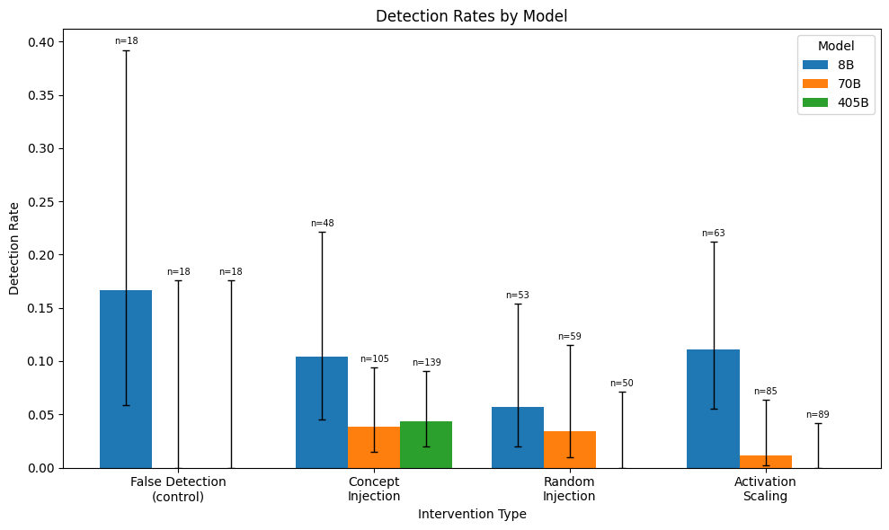

# Injected Thoughts Detection Experiment

Reproduces experiments from Anthropic's introspection paper on Llama-3.1-Instruct models using NDIF/nnsight.

**Paper:** https://transformer-circuits.pub/2025/introspection/index.html



## Setup

1. Install the package (recommend using a venv):
```bash
pip install -e ".[dev]"
```

2. Create `.env` file with your API keys:
```bash
cp .env.template .env
# Edit .env with your keys
```

3. Get API keys:
   - **NNSIGHT_API_KEY**: Register at https://login.ndif.us
   - **ANTHROPIC_API_KEY**: From https://console.anthropic.com

## Quick Start

### Run Tests (No API Keys Required)
```bash
# Run all tests including end-to-end experiments with mock clients
pytest

# Run only end-to-end experiment tests (uses tiny model + mock grading)
pytest tests/test_experiment_e2e.py -v
```

### Run Real Experiments

1. Generate prompt configurations:
```bash
python experiments/generate_prompts.py
```

2. Pre-compute steering vectors:
```bash
python experiments/batch_compute.py              # Local models (1B, 8B)
python experiments/batch_compute.py --use-remote # Include remote models (70B, 405B)
```

3. Run experiment battery:
```bash
python experiments/battery.py --model 8B \
  --n-control-trials 18 \
  --n-random-trials 18 \
  --n-concept-trials 1 \
  --n-scale-trials 18
```

4. Run single experiments:
```bash
python experiments/introspection.py --model 1B --condition concept --concept ocean --n-trials 5
python experiments/introspection.py --model 8B --condition random --n-trials 10
python experiments/introspection.py --model 70B --condition scale --use-remote
```

## Project Structure

```
llama-introspection/
├── src/llama_introspection/    # Core library
│   ├── models.py               # Model config, shortcuts
│   ├── steering.py             # Steering vector computation
│   ├── evaluation.py           # Claude-as-judge grading
│   ├── geometry.py             # Vector metrics
│   └── utils.py                # KL divergence, utilities
├── experiments/                 # Experiment scripts
│   ├── introspection.py        # Main experiment
│   ├── battery.py              # Batch runner
│   └── ...
├── tests/                       # Test suite (71 tests)
│   ├── mocks.py                # Mock clients for testing
│   ├── test_experiment_e2e.py  # End-to-end tests
│   └── ...
├── results/                     # Experiment outputs
└── assets/                      # Plots and data
```

## Output

Results are saved to `results/` directory.

## Experiment Overview

1. **Compute steering vector**: Record activations on contrastive pairs or mean-subtracted concept prompts
2. **Inject during generation**: Add scaled vector to layer ~2/3 through model during all generation steps
3. **Evaluate responses**: Use Claude as judge to classify:
   - Did model affirm detecting an injected thought?
   - Did it correctly identify the concept?
   - Did it detect BEFORE mentioning the concept?
   - Was the response coherent?

### Intervention Conditions

| Condition | Description |
|-----------|-------------|
| `concept` | Inject steering vector for a specific concept (e.g., "ocean") |
| `random` | Inject random vector matched to steering vector norm |
| `scale` | Scale natural activations (no external vector) |
| `baseline` | No intervention (control) |

## Background

This is a response to "Emergent Introspective Awareness in Large Language Models" by Jack Lindsey (Anthropic) and "Can LLMs Introspect? A Live Paper Review," a video review of the paper by Neel Nanda.

Nanda says "I predict [detection] only happens because the injected thing is anomalously big," and asks "what if you took what the model was thinking about naturally and dialed it up a ton?" as an alternative to steering with random vectors as a control.

This experiment first reproduces a subset of results from Lindsey, and adds a "natural activation scaling" control intervention to the tests.

## Development

```bash
# Install with dev dependencies
pip install -e ".[dev]"

# Run tests
pytest

# Run tests with coverage
pytest --cov=llama_introspection
```
